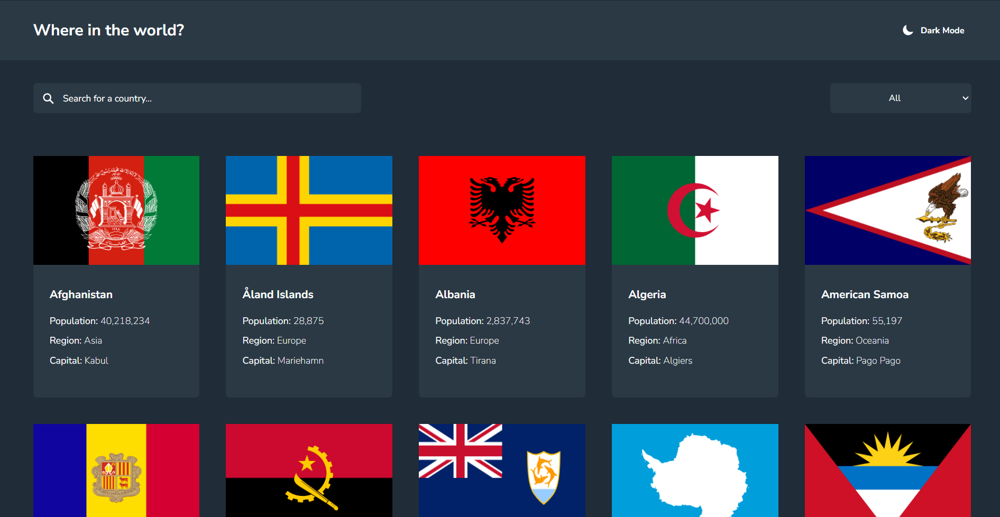
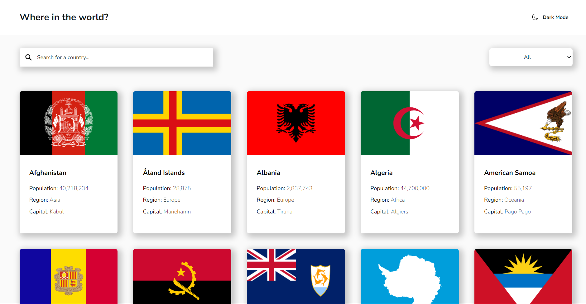
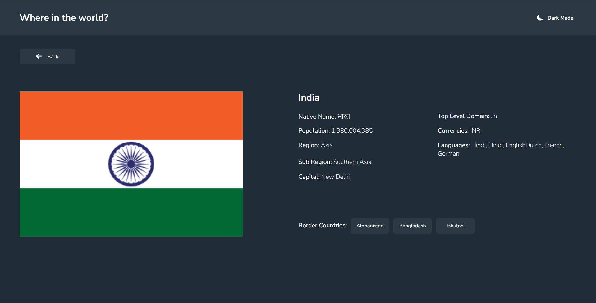
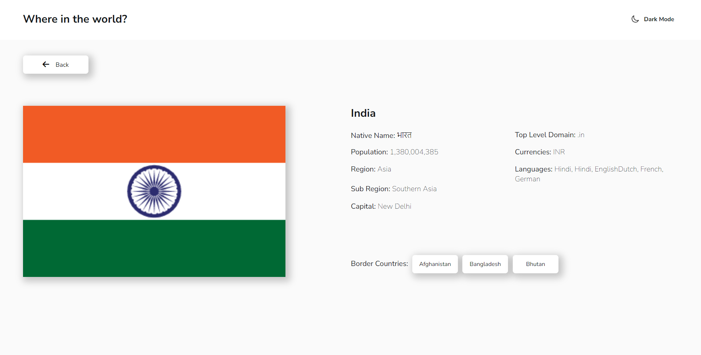

# All About Countries
All About Countries is an application created using Vanilla Javascript, and Native Fetch API. Users can search for a country, and filter them based on their regions(continent). The application also comes with color toggle scheme. The application is one of the Frontend Mentor's challenge.

## Screenshot
Here are some screenshots to the Todo App.

## Links
Here is the live URL to [All About Countries](https://all-about-countries.vercel.app/)

## My process
### Build With 
- Semantic HTML5 markup
- Flexbox
- CSS Grid
- Vanilla Javascript
- Fetch API
- Async/Await

### What I Learned
While building the All About Countries App, I used various Javascript concepts like DOM, Events, Destructuring, Async/Await, and Fetch API. Several CSS concepts like Grid, Flexbox, and Responsiveness were used in building the application.

